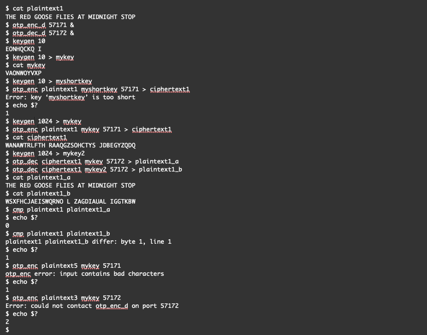

## oneTimePad
This program consists of five small programs that encrpyt and decrypt information using a one-time pad system:
- The keygen.c program creates a key file of specified length. The characters in the file generated are any of the 27 allowed characters(A-Z and ' ') and are generated using the standard UNIX randomization methods.
The last character this program outputs is a newline. This program outputs to stdout. Please note that keylength below is the length of the key file in characters. The syntax for this program is:\
    keygen keylength
- The otp_dec_d.c program will run in the background as a daemon. Upon execution, it will output an error if it cannot be run due to a network error, such as the ports being unavailable. Its function is to perform the decoding
of the ciphertext file that is sent to it via a key using one-time pad style encryption. Please note that this program utlizes modulo 27 as the space character is allowed in the ciphertext files. This program will 
listen on a particular port/socket, assigned when it first ran. When a connection is made, this program will receive from otp_dec a ciphertext and a key via the communication socket. A child of this program will then write  
back the plaintext to the otp_dec process that it is connected to via the same communication socket. This program supports up to 5 concurrent socket connections running at the same time. The listening_port is the port that this program will listen on and will always be started in the background. All errors are output to stderr but will not crash or otherwise exit, unless the erros happen when the programis starting up. This program uses "localhost" as the target IP address/host.The syntax for this program is:\
    otp_dec_d listening_port
- The otp_dec.c program connects to otp_dec_d and asks it to perform a one-time pad style decryption. This program does not do the decryption but receives the decrypted text back from otp_dec_d. The syntax for this program is:\
    otp_dec ciphertext key port\
In the syntax above, ciphertext is the name of a file in the current directory that contains the ciphertext to decrypt, key contains the encryption key that will be used to decrypt the text and port is the port that this program should attempt to connect to otp_dec_d on. When this program receives the plaintext back from otp_dec_d, it will output it to stdout. If this program receives key or ciphertext files with any bad characters in them, or the key file is shorter than the plaintext file, it will terminate, send appropriate error text to sterr and set the exit value to 1. This program cannot connect to otp_enc_d. All error text will be output to stderr.
- The otp_enc_d.c program will run in the background as a daemon. Upon execution, it will output an error if it cannot be run due to a network error, such as the ports being unavailable. Its function is to perform the encoding of the plaintext file that is sent to it via a key using one-time pad style encryption. Please note that this program utlizes modulo 27 as the space character is allowed in the plaintext files. This program will listen on a particular port/socket, assigned when it first ran. When a connection is made, this program will receive from otp_enc a plaintext and a key via the communication socket. A child of this program will then write back the ciphertext to the otp_enc process that it is connected to via the same communication socket. This program supports up to 5 concurrent socket connections running at the same time. The syntax for this program is:\
    otp_enc_d listening_port\
The listening_port is the port that this program will listen on and will always be started in the background. All errors are output to stderr but will not crash or otherwise exit, unless the erros happen when the program is starting up. This program uses "localhost" as the target IP address/host.
- The otp_enc.c program connects to otp_enc_d and asks it to perform a one-time pad style encryption. This program does not do the encryption but receives the encrypted text back from otp_enc_d. The syntax for this program is:\
    otp_enc plaintext key port\
    
In the syntax above, plaintext is the name of a file in the current directory that contains the plaintext to encrypt, key contains the encryption key that will be used to encrypt the text and port is the port that this program should attempt to connect to otp_enc_d on. When this program receives the ciphertext back from otp_enc_d, it will output it to stdout. If this program receives key or plaintext files with any bad characters in them, or the key file is shorter than the plaintext file, it will terminate, send appropriate error text to sterr and set the exit value to 1. This program cannot connect to otp_dec_d. All error text will be output to stderr.

### Deployment
After cloning the respository, please follow the steps below to run the keygen.c, otp_dec_d.c, otp_dec.c, otp_enc_d.c and otp_enc.c programs:
1) Create or import a plaintext file into the cloned respository directory. Please note, you may only use the 27 allowed characters(A-Z and ' '). If your file contains any other characters, you will receive an error message.

2) Run the following 2 commands to execute the compilation script:\
    chmod +x compileall\
    compileall

### Example
Here is an example run of oneTimePad:

### Notes
- The programs listed above were tested on my university's UNIX servers called os1
